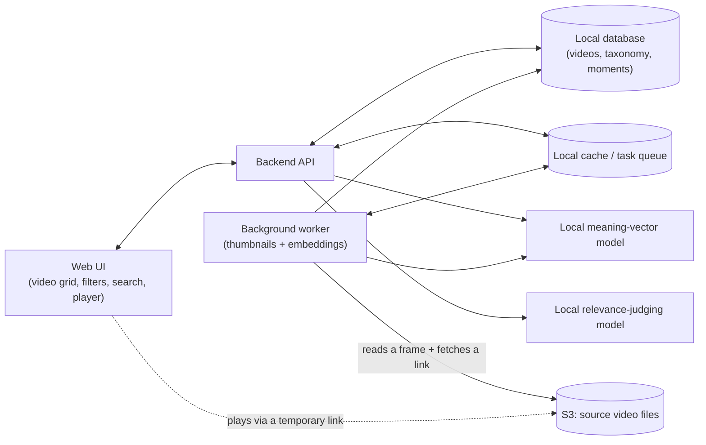
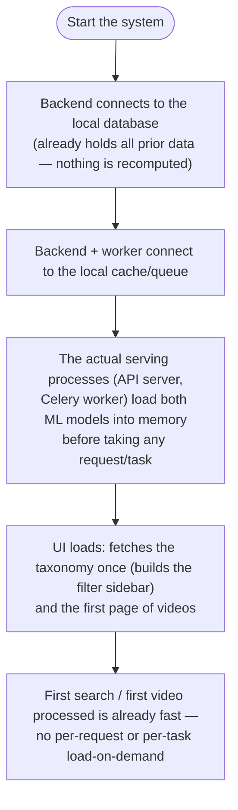
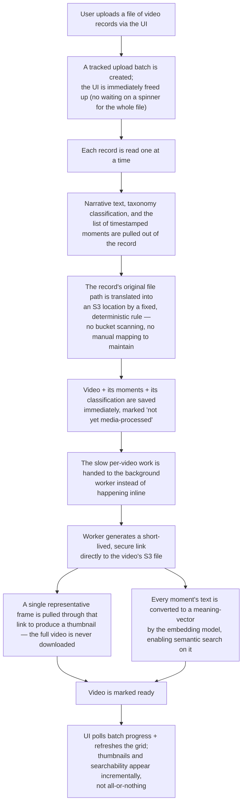

# Video Search POC — Architecture & Flows

> This describes the system as actually built: a local, self-hosted video
> search application (backend + UI) over the Be-My-Eyes ego-assist dataset.
> It supersedes the original backend-only, AWS-hosted blueprint this file
> used to contain — the POC grew a UI and moved to a fully local stack
> (SQLite + Redis + local models) instead of RDS/pgvector/ECS. Conceptual
> and flow-level only; no code, schemas, or API payloads here.

---

## 1. System at a glance

- **Backend API** — serves the UI, applies filters, runs search, accepts new
  data uploads. Everything runs on one machine for this POC.
- **Local database** — holds every video's metadata, its taxonomy
  classification, its moment-by-moment breakdown, and the taxonomy
  definition itself.
- **Local cache / task queue** — two jobs: (a) lets slow-to-build search
  data structures be reused across requests instead of rebuilt every time,
  and (b) hands off slow per-video work (thumbnailing, embedding) to a
  background worker so uploads don't block the UI.
- **Background worker** — does the parts of ingesting a video that take real
  time: pulling a frame for a thumbnail, computing meaning-vectors for every
  moment in the video.
- **Two local models, both self-hosted, neither a cloud/LLM API**:
  - a small **meaning-vector model** that turns any piece of text (a video
    moment's description, or a search query) into a numeric vector such
    that similar meanings land near each other — used for semantic search
    and computed once per moment, reused forever.
  - a small **relevance-judging model** that, given a query and a candidate
    moment's text *together*, directly judges how well it satisfies the
    query — used only as a final double-check on the best few candidates
    (see §6), because unlike the meaning-vector model its judgments can't be
    precomputed and cached.
- **S3** — read-only source of the actual video files. Nothing is ever
  written back to it, and full videos are never copied locally — only a
  single thumbnail frame per video is kept on disk.

---

## 2. Data concepts

Nothing here is a schema — just the ideas the system reasons about.

- **Taxonomy**: a fixed set of classification *facets* (e.g. what kind of
  request, what environment, what device was used), each with a fixed list
  of allowed *values*. Some facets allow only one value per video, others
  allow several. The set of facets/values is static in concept but is
  editable data — an administrator can rename or add allowed values without
  touching anything else.
- **Video**: one entry per source recording. Carries its narrative summary,
  its taxonomy classification, where its underlying file lives, and its
  current processing state (still being thumbnailed/embedded, ready, or
  failed).
- **Moment** (internally: a "segment"): a video is broken into many
  short, timestamped moments, each with its own short description and a
  confidence score describing how well-evidenced that moment's description
  is. This is the unit search actually operates on — a video is *found* by
  one or more of its moments matching, not as an indivisible whole.
- **Upload batch**: one tracked act of submitting a file of many video
  records at once, so its progress and partial failures can be observed.

---

## 3. Startup flow

The important idea: the model *weights* are baked into the backend/worker
image at build time (so no process ever downloads them over the network at
runtime), and each long-running server process (the API server, each Celery
worker) loads both models into memory once, at process start, before it ever
serves a request or picks up a task. One-off commands (migrate, seed_taxonomy,
management commands, tests) deliberately skip this preload so they stay fast
and lightweight — only the processes that actually stay warm and handle
search/ingestion traffic pay the load cost, and they pay it once, up front,
not on whichever request happens to be first.

---

## 4. Initial seeding flow

Two independent, idempotent, one-time (but safely repeatable) steps:

1. **Taxonomy seeding** — the static taxonomy definition is read and used to
   create/update the facets and their allowed values in the database. Safe
   to re-run any time the definition changes; it never touches video data.
2. **Dataset ingestion** — the initial 200-video dataset is fed through the
   *exact same mechanism* as any later upload (§5) — there's no separate
   "bulk import" code path. This matters: the system that loads the very
   first video and the system that loads the 201st video are one and the
   same, so the behavior a user sees when uploading later is already
   proven at seed time.

---

## 5. New video upload flow

Two design choices worth calling out:

- **The S3 mapping needs no lookup table and no bucket listing.** Every
  record already carries the file path it was originally processed from on
  a shared machine; that path and the S3 layout differ only by a fixed
  prefix. Stripping that prefix *is* the S3 key. This means any future
  upload from the same recording pipeline resolves automatically — the only
  thing that could ever break it is that pipeline changing its own folder
  convention.
- **Nothing about the video file itself is ever stored locally.** Only a
  single JPEG thumbnail per video lives on the local disk; playback and
  thumbnailing both go through short-lived links straight to S3. This keeps
  local storage flat regardless of how many or how large the source videos
  are.

---

## 6. Search query flow

This is the part that improves on a naive "one query vector vs one document
vector" design, specifically to handle **compound conditions** — a query
like "walking in rain" should require *both* ideas to be present, not
reward a moment that's strongly about only one of them.

```mermaid
flowchart TD
    Q["Natural-language query + any active filters"]
    Q --> FILTER["Filters narrow which videos are even considered\nbefore any relevance scoring happens"]
    FILTER --> DECOMPOSE["Query is split into its underlying concepts when it\ncontains connecting words suggesting more than one\ncondition (e.g. 'walking in rain' -> 'walking' + 'rain');\na single-idea query passes through unchanged"]
    DECOMPOSE --> SCORE["Every remaining moment is scored against EACH\nconcept separately, two ways per concept:\n- meaning-vector closeness (catches paraphrase)\n- keyword overlap (catches exact terms/names)"]
    SCORE --> COMBINE["A moment's score = its WEAKEST concept's score\n(not an average) -- this is what enforces\n'all conditions must hold', not 'any one strongly enough'"]
    COMBINE --> GATE["Moments below the confidence floor are dropped"]
    GATE --> MERGE["Remaining moments close together in time, within the\nsame video, are stitched into one continuous span\n(so a match reads as '10s-34s', not a dozen fragments)"]
    MERGE --> SHORTLIST["Spans are ranked by their first-pass score;\nonly the strongest handful (a configurable number)\nmove to the next step"]
    SHORTLIST --> RERANK["Each shortlisted span's full text is re-read\nTOGETHER with the query by the relevance-judging model\n-- this is the step that can actually tell whether a\nspan satisfies the query AS STATED, not just\n'is generally in the neighborhood of it'"]
    RERANK --> FINAL["The reranked handful get their final confidence from\nthis judgment; everything below the shortlist keeps its\nfirst-pass score and is appended after"]
    FINAL --> RESULT["Result: timestamped spans, each with a confidence score\nand which query concepts it did/didn't strongly satisfy"]
```

Why two separate scoring passes instead of one:

- The **first pass** (meaning-vector + keyword, per concept, combined by
  weakest-concept) has to run against *every* candidate moment, so it must
  stay cheap — its cost is proportional to how much of the library survives
  filtering.
- The **second pass** (the relevance-judging model reading query and span
  together) is far better at judging compound conditions correctly, because
  it can actually attend to both at once instead of comparing two
  independently-computed vectors — but its cost can't be precomputed or
  cached, so it's only ever run on the small shortlist that made it through
  the first pass. This is what keeps search fast regardless of how large
  the video library grows: the expensive step's cost depends only on the
  shortlist size, never on the total number of videos.

---

## 7. Filters + search are one pass, not two

Whatever is selected in the filter sidebar is applied *before* any query
scoring happens (§6, first box) — filters and natural-language search
aren't independent stages layered afterward. A search always operates over
"whatever currently matches the active filters," and filters alone (with no
query at all) just list matching videos directly, without invoking either
model.

---

## 8. What's intentionally simple at this scale

- Every model involved is small, self-hosted, and runs on CPU without
  issue at this library size — no cloud LLM or hosted API is used anywhere
  in the pipeline, by design.
- The underlying data structures for search are rebuilt in memory rather
  than kept in a specialized search engine — appropriate for a library of a
  few hundred videos, not a design meant to hold at a much larger one (see
  the note on growth below).
- No user accounts/auth — this is a single-operator local tool.
- **On growth**: the relevance-judging step (§6) is deliberately built so
  its cost never depends on library size. What *would* need to change well
  before reaching a much larger library is the first-pass keyword scoring,
  which today is rebuilt fresh for every query — that piece would need to
  become a precomputed/incremental index rather than the current
  rebuild-every-time approach.
